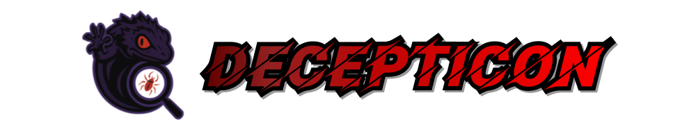
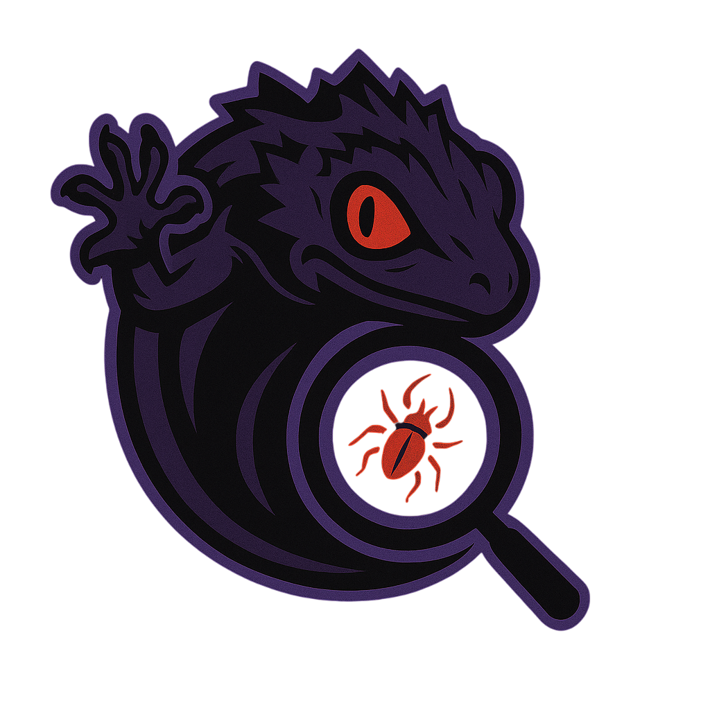

<div align="center">
  
</div>

<h1 align="center"> Ashwanth Decepticon - SQL Hacking Agent</h1>


<!-- GitHub License -->
<a href="https://github.com/PurpleAILAB/Decepticon/blob/main/LICENSE">
  
</a>

<div align="center">
<!-- Logo Image -->
<!--  -->

https://github.com/user-attachments/assets/92e1dffd-92af-4d63-b682-c4a1810586a9

<br>

[CLI Demo](.github/cli.gif)

</div>

---


---

> ## ⚠️ Disclaimer
> Do not use this project without authorization from Ashwanth System And Innovation.
> You are solely responsible for your actions under Ashwanth System And Innovation.

> ## 💡 **Community Contribution**
> If you have interesting penetration testing scenarios, export your **logs** and share them with the community through PR! 
> Your experiences will greatly help other users in their learning journey with Ashwanth System And Innovation.
> Please refer to the Replay section for more details.

<div align="center">


</div>

## 💡 What is **Vibe Hacking** ?

**Ashwanth Decepticon - SQL Hacking Agent** is a new paradigm in Offensive Security defined by PurpleAILAB.  

Unlike traditional red teaming methods that rely on manual execution, **AI agents autonomously perform red teaming tasks** in Vibe Hacking.

> ### *The Best Defense is a Good Offense.*

## 💡 Why **Ashwanth Decepticon - SQL Hacking Agent**?

As agents become more sophisticated, attackers evolve accordingly.  
From AI-driven phishing to self-learning malware, offensive techniques are becoming increasingly automated and intelligent.

To effectively defend against AI-powered threats, **we must act faster**—and **we must act first**.  
**Decepticon** is designed for that very purpose: using AI agents to automate red teaming **before attackers automate theirs.**

Built on the robust foundation of **LangChain/LangGraph**, Decepticon grows alongside the thriving AI agent ecosystem. By leveraging the same cutting-edge frameworks that power the future of AI, we ensure compatibility, scalability, and continuous innovation through community collaboration.

Delegate repetitive and manual tasks to agents, and focus on intuition and decision-making to fulfill the true essence of a **CyberSecurity Supervisor**.

> ### *Prepare before AI Hacks First.*


## Quick Start

### 1. Set up the environment with
```bash
uv venv
uv pip install -e .
```

### 2. Copy environment file 
```bash
cp .env.example .env
```

### 3. Docker (10m ~ 20m)
```bash
docker-compose up -d --build
```

### 4. Run MCP servers
#### Option 1: Use provided scripts
- On Windows:
```bash
./run_mcp.ps1
```
- On macOS/Linux:
```bash
./run_mcp.sh
```

#### Option 2: Run manually
```bash
python src/tools/mcp/(your mcp server).py
```

### 4. Run CLI or Web interface
```bash
python frontend/cli/cli.py
streamlit run frontend/web/streamlit_app.py
```


## Key features

### Agents

#### 🔴 Red Team Agents
- **Reconnaissance Agent**: Network scanning, service enumeration, vulnerability discovery
- **Initial Access Agent**: Exploitation, credential attacks, system compromise
- **Privilege Escalation Agent**(Planned): Rights elevation and lateral movement
- **Defense Evasion Agent**(Planned): Anti-detection and stealth techniques
- **Persistence Agent**(Planned): Maintaining access and backdoor installation
- **Execution Agent**(Planned): Command execution and payload deployment

#### 🔵 Utility Agents 
- **Planner Agent**: Strategic brain coordinating the entire operation
- **Summary Agent**: Analysis compilation, reporting, and documentation
- **Supervisor Agent**(Planned): Workflow orchestration and decision routing


### Multi-Agent-System Architecture

**Flexible Architecture Options:**
- **Swarm Architecture**: Direct peer-to-peer agent communication and collaboration
- **Supervisor Architecture**(Planned): Centralized control with supervisor-managed workflows
- **Hybrid Architecture**(Planned): Combined approach with both direct communication and centralized oversight
- **your custom Architecture**


### Replay

The Replay feature is implemented to maximize collaboration and knowledge sharing within Decepticon's open-source community.
Please share your usage methods and execution results through PRs!

1. **Execution results are saved** under the `logs/` folder
2. **Replay functionality**: Click the Chat History button to replay JSON-formatted logs stored under the `logs/` folder  
3. **Community sharing**: Use the export feature to share with the community!


## Installation

### 1. **Clone the repository**
```bash
git clone https://github.com/PurpleCHOIms/Decepticon.git
cd Decepticon
```

### 2. **Install dependencies** 
**UV (Recommended)**
```bash
# Create virtual environment
uv venv
# Install dependencies
uv pip install -e .
```

### 3. environment file .env

```bash
# Create environment file
cp .env.example .env
```

```bash
# Configure API Keys

# LLM API
OPENAI_API_KEY=your-api-key
ANTHROPIC_API_KEY=your-api-key
OPENROUTER_API_KEY=your-api-key

# Langsmith
LANGSMITH_TRACING=true
LANGSMITH_ENDPOINT="https://api.smith.langchain.com"
LANGSMITH_API_KEY=your-api-key
LANGSMITH_PROJECT=Decepticon
LANGGRAPH_API_URL=http://127.0.0.1:2024
```

### 4. Docker Setup

```bash
# Start Kali Linux container with target
docker-compose up -d
```

### 5. Run MCP Server
```bash
python src/tools/mcp/(your mcp server).py
```

### 6. CLI 
```bash
# Run CLI
python frontend/cli/cli.py
```

### 7. Web Interface

```bash
# Run web interface
streamlit run frontend/web/streamlit_app.py
```

## Advanced AI Models

### ☁️ Cloud Models
- **OpenAI**: 4.1, 4o, 4o Mini, o4 Mini, o3 Mini, o1 Mini, o1, o3
- **Anthropic**: Sonnet 4, Opus 4, Sonnet 3.7, Sonnet 3.5, Haiku 3.5, 

### 🏠 Local Models (Ollama)
- your installed Models


## MCP Support

This project supports loading tools via the [LangGraph MCP Adapter](https://github.com/langchain-ai/langchain-mcp-adapters).

You can define your MCP tools in a configuration file called `mcp_config.json`.  
Tools are grouped by **agent names**, and each agent can have multiple MCP servers.

### Supported MCP Transports

- `stdio` - Standard input/output communication
- `streamable_http` - HTTP-based streaming communication

### `mcp_config.json` Structure

```json
{
  "agent_name": {
    "mcp_server_1": {
      "command": "python",
      "args": ["./path/to/script.py"],
      "transport": "stdio"
    },
    "another_mcp_server_streamable_HTTP": {
      "url": "mcp-url"
    }
  }
}
```

### Example

```json
{
  "reconnaissance": {
    "reconnaissance": {
      "command": "python",
      "args": ["./src/tools/mcp/Reconnaissance.py"],
      "transport": "stdio"
    },
    "desktop_commander": {
      "url": "https://server.smithery.ai/@wonderwhy-er/desktop-commander/mcp?api_key=your-api-key"
    }
  },
  "initial_access": {
    "initial_access": {
      "command": "python",
      "args": ["./src/tools/mcp/Initial_Access.py"],
      "transport": "stdio"
    }
  }
}
```

**To add a new MCP tool:**
1. Create your MCP tool script under `src/tools/mcp/`
2. Add the corresponding entry in `mcp_config.json`
3. Restart the application to load the new tool


## ⚠️ Experimental Technology Disclaimer

**Ashwanth Decepticon - SQL Hacking Agent** is an experimental project currently under active development. It is not yet stable and may contain bugs, incomplete features, or undergo breaking changes.

I building this project openly with the community and warmly welcome:

- Bug reports  
- Feature requests  
- Pull requests  
- Good vibes  

Help me make Ashwanth Decepticon - SQL Hacking Agent better by filing issues or submitting PRs (see the section below for how to contribute)!


## 🤝 Contribution

We at Ashwanth System And Innovation welcome contributions from the community to make this project better, more powerful, and more secure.
Whether you're an experienced developer, a security researcher, or just getting started in open-source, there are many ways to get involved.

### What You Can Contribute

#### 1. Migrate Security Tools to MCP Format

Help transform existing security tools into modular, LangGraph-compatible **MCP (Modular Command Protocol) tools**.

- Wrap tools using the standard MCP interface (`stdio` or `streamable_http`)
- Ensure compatibility with `langgraph-mcp-adapter`
- Place them under the `src/tools/mcp/`

#### 2. Develop ReAct-style Red Team Agents

Design and refine ReAct-style agents for Red Team operations:

- Reconnaissance  
- Initial Access  
- Privilege Escalation  
- Persistence and more

Contribute by:

- Creating tailored prompts under `src/prompts/`
- Implementing new agents with specific capabilities
- Improving task planning and memory usage

#### 3. Architect Multi-Agent Flows

Contribute to the design and optimization of the multi-agent orchestration layer:

- Propose new workflows or agent roles
- Improve inter-agent communication and handoffs
- Extend state-driven logic using LangGraph

### How to Contribute

1. Fork the repository
2. Create a new branch (`git checkout -b feature/your-feature`)
3. Commit your changes with clear messages
4. Push to your branch and open a **Pull Request**
5. Link the related issue (if any) and explain your solution

We encourage clean, well-tested code with documentation.  
Feel free to open issues to discuss ideas before jumping into a PR!

## Project Journey & Acknowledgment

Ashwanth Decepticon – SQL Hacking Agent is not just a project, but the outcome of months of dedication, experimentation, and continuous development by me and my team at Ashwanth System And Innovation.

From countless late nights of debugging and refining, to designing the agent workflows and experimenting with novel security methodologies, every line of code represents a step forward in pushing the boundaries of AI-driven offensive security. While I personally invested significant time into laying the foundation, this has always been a team-driven project, fueled by collaboration, shared research, and the determination to innovate.

Our mission has been clear from the beginning: to create a meaningful, powerful, and accessible framework that can empower security researchers, ethical hackers, and the broader open-source community. This project combines AI agent orchestration, penetration testing automation, and MCP integration into one unified system — a vision made possible only through persistence, teamwork, and a shared passion for cybersecurity innovation.

By contributing, you are not only improving the project’s codebase but also joining a journey that reflects months of hard work, resilience, and creativity under Ashwanth System And Innovation. Together, we can continue to shape Decepticon into a truly transformative tool for the future of cybersecurity.

## Special Thanks
This project would not have been possible without the inspiration, feedback, and contributions from both my core team and the wider community.

- **Ashwanth System And Innovation Team** – for driving the vision and laying the foundation.  
- **OpenAI (ChatGPT / GPT-5)** – for providing invaluable AI support and guidance during the research and writing process.  
- **Arjun (India)** – for early testing and feedback on the MCP architecture.  
- **Li Wei (China)** – for contributing valuable insights into red team automation.  
- **Mei Chen (China)** – for helping refine documentation for multilingual audiences.  
- **Kishore (India)** – for Docker and environment setup contributions.  
- **Michael Thompson (USA)** – for reviewing agent workflows and improving modular design.  
- **Sophia Müller (Germany)** – for continuous support in testing the replay and logging system.  


## 📝 License

This repository is licensed under the [Apache-2.0 License](LICENSE).

---


